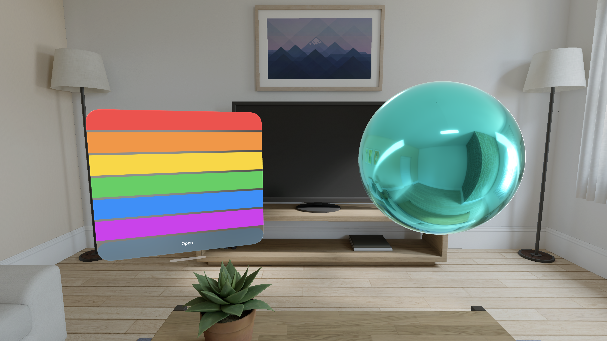

# MySwiftUI

SwiftUI & RealityKit Disassembly

## Requirements

- Xcode 27.0

- visionOS 26.5

## Implemented APIs

### SwiftUI

- Views
  - [`View`](https://developer.apple.com/documentation/swiftui/view)
  - [`EmptyView`](https://developer.apple.com/documentation/swiftui/emptyview)
  - [`AnyView`](https://developer.apple.com/documentation/swiftui/anyview)
  - [`Color`](https://developer.apple.com/documentation/swiftui/color)
  - [`Color.red`](https://developer.apple.com/documentation/swiftui/color/red)
  - [`Color.orange`](https://developer.apple.com/documentation/swiftui/color/orange)
  - [`Color.yellow`](https://developer.apple.com/documentation/swiftui/color/yellow)
  - [`Color.green`](https://developer.apple.com/documentation/swiftui/color/green)
  - [`Color.mint`](https://developer.apple.com/documentation/swiftui/color/mint)
  - [`Color.teal`](https://developer.apple.com/documentation/swiftui/color/teal)
  - [`Color.cyan`](https://developer.apple.com/documentation/swiftui/color/cyan)
  - [`Color.blue`](https://developer.apple.com/documentation/swiftui/color/blue)
  - [`Color.indigo`](https://developer.apple.com/documentation/swiftui/color/indigo)
  - [`Color.purple`](https://developer.apple.com/documentation/swiftui/color/purple)
  - [`Color.pink`](https://developer.apple.com/documentation/swiftui/color/pink)
  - [`Color.brown`](https://developer.apple.com/documentation/swiftui/color/brown)
  - [`Color.white`](https://developer.apple.com/documentation/swiftui/color/white)
  - [`Color.gray`](https://developer.apple.com/documentation/swiftui/color/gray)
  - [`Color.black`](https://developer.apple.com/documentation/swiftui/color/black)
  - [`Color.clear`](https://developer.apple.com/documentation/swiftui/color/clear)
  - [`Color.primary`](https://developer.apple.com/documentation/swiftui/color/primary)
  - [`Color.secondary`](https://developer.apple.com/documentation/swiftui/color/secondary)
  - [`Color.init(cgColor:)`](<https://developer.apple.com/documentation/swiftui/color/init%28cgcolor%3A%29>)
  - [`Color.init(uiColor:)`](<https://developer.apple.com/documentation/swiftui/color/init%28uicolor%3A%29>)
  - [`Color.resolve(in:)`](<https://developer.apple.com/documentation/swiftui/color/resolve%28in%3A%29>)
  - [`Group`](https://developer.apple.com/documentation/swiftui/group)
  - [`HStack`](https://developer.apple.com/documentation/swiftui/hstack)
  - [`VStack`](https://developer.apple.com/documentation/swiftui/vstack)
  - [`ZStack`](https://developer.apple.com/documentation/swiftui/zstack)
  - [`GeometryReader`](https://developer.apple.com/documentation/swiftui/geometryreader)
  - [`GeometryReader3D`](https://developer.apple.com/documentation/swiftui/geometryreader3d)
  - [`ViewBuilder`](https://developer.apple.com/documentation/swiftui/viewbuilder)
  - [`TupleView`](https://developer.apple.com/documentation/swiftui/tupleview)

- Layouts
  - [`AnyLayout`](https://developer.apple.com/documentation/swiftui/anylayout)
  - [`HStackLayout`](https://developer.apple.com/documentation/swiftui/hstacklayout)
  - [`VStackLayout`](https://developer.apple.com/documentation/swiftui/vstacklayout)
  - [`Layout`](https://developer.apple.com/documentation/swiftui/layout)
  - [`ProposedViewSize`](https://developer.apple.com/documentation/swiftui/proposedviewsize)
  - [`Alignment`](https://developer.apple.com/documentation/swiftui/alignment)
  - [`HorizontalAlignment`](https://developer.apple.com/documentation/swiftui/horizontalalignment)
  - [`VerticalAlignment`](https://developer.apple.com/documentation/swiftui/verticalalignment)

- App and scenes
  - [`App`](https://developer.apple.com/documentation/swiftui/app)
  - [`App.main()`](https://developer.apple.com/documentation/swiftui/app/main%28%29)
  - [`Scene`](https://developer.apple.com/documentation/swiftui/scene)
  - [`WindowGroup`](https://developer.apple.com/documentation/swiftui/windowgroup)
    - [`init(id:makeContent:)`](https://developer.apple.com/documentation/swiftui/windowgroup/init%28id%3Amakecontent%3A%29)
    - [`init(_: Text, id:makeContent:)`](https://developer.apple.com/documentation/swiftui/windowgroup/init%28_%3Aid%3Amakecontent%3A%29)
    - [`init(_: LocalizedStringKey, id:makeContent:)`](https://developer.apple.com/documentation/swiftui/windowgroup/init%28_%3Aid%3Amakecontent%3A%29)
    - [`init(_: LocalizedStringResource, id:makeContent:)`](https://developer.apple.com/documentation/swiftui/windowgroup/init%28_%3Aid%3Amakecontent%3A%29)
    - [`init<S>(_: S, id:makeContent:)`](https://developer.apple.com/documentation/swiftui/windowgroup/init%28_%3Aid%3Amakecontent%3A%29)
    - [`init(makeContent:)`](https://developer.apple.com/documentation/swiftui/windowgroup/init%28makecontent%3A%29)
    - [`init(_: Text, makeContent:)`](https://developer.apple.com/documentation/swiftui/windowgroup/init%28_%3Amakecontent%3A%29)
    - [`init(_: LocalizedStringKey, makeContent:)`](https://developer.apple.com/documentation/swiftui/windowgroup/init%28_%3Amakecontent%3A%29)
    - [`init(_: LocalizedStringResource, makeContent:)`](https://developer.apple.com/documentation/swiftui/windowgroup/init%28_%3Amakecontent%3A%29)
    - [`init<S>(_: S, makeContent:)`](https://developer.apple.com/documentation/swiftui/windowgroup/init%28_%3Amakecontent%3A%29)
  - [`ImmersiveSpace`](https://developer.apple.com/documentation/swiftui/immersivespace)
    - [`init(id:makeContent:)`](https://developer.apple.com/documentation/swiftui/immersivespace/init%28id%3Amakecontent%3A%29)

- Window and immersion styles
  - [`WindowStyle`](https://developer.apple.com/documentation/swiftui/windowstyle)
  - [`Scene.windowStyle(_:)`](https://developer.apple.com/documentation/swiftui/scene/windowstyle%28_%3A%29)
  - [`VolumetricWindowStyle`](https://developer.apple.com/documentation/swiftui/volumetricwindowstyle)
  - [`VolumetricWindowStyle.init()`](https://developer.apple.com/documentation/swiftui/volumetricwindowstyle/init%28%29)
  - [`WindowStyle.volumetric`](https://developer.apple.com/documentation/swiftui/windowstyle/volumetric)
  - [`ImmersionStyle`](https://developer.apple.com/documentation/swiftui/immersionstyle)
  - [`Scene.immersionStyle(selection:in:)`](https://developer.apple.com/documentation/swiftui/scene/immersionstyle%28selection%3Ain%3A%29)
  - [`AutomaticImmersionStyle`](https://developer.apple.com/documentation/swiftui/automaticimmersionstyle)
  - [`AutomaticImmersionStyle.init()`](https://developer.apple.com/documentation/swiftui/automaticimmersionstyle/init%28%29)
  - [`ImmersionStyle.automatic`](https://developer.apple.com/documentation/swiftui/immersionstyle/automatic)
  - [`FullImmersionStyle`](https://developer.apple.com/documentation/swiftui/fullimmersionstyle)
  - [`FullImmersionStyle.init()`](https://developer.apple.com/documentation/swiftui/fullimmersionstyle/init%28%29)
  - [`ImmersionStyle.full`](https://developer.apple.com/documentation/swiftui/immersionstyle/full)
  - [`MixedImmersionStyle`](https://developer.apple.com/documentation/swiftui/mixedimmersionstyle)
  - [`MixedImmersionStyle.init()`](https://developer.apple.com/documentation/swiftui/mixedimmersionstyle/init%28%29)
  - [`ImmersionStyle.mixed`](https://developer.apple.com/documentation/swiftui/immersionstyle/mixed)
  - [`ProgressiveImmersionStyle`](https://developer.apple.com/documentation/swiftui/progressiveimmersionstyle)
  - [`ProgressiveImmersionStyle.init()`](https://developer.apple.com/documentation/swiftui/progressiveimmersionstyle/init%28%29)
  - [`ImmersionStyle.progressive`](https://developer.apple.com/documentation/swiftui/immersionstyle/progressive)

- State and environment
  - [`State`](https://developer.apple.com/documentation/swiftui/state)
  - [`Binding`](https://developer.apple.com/documentation/swiftui/binding)
  - [`Binding.init(get:set:)`](<https://developer.apple.com/documentation/swiftui/binding/init%28get%3Aset%3A%29>)
  - [`Binding.constant(_:)`](<https://developer.apple.com/documentation/swiftui/binding/constant%28_%3A%29>)
  - [`StateObject`](https://developer.apple.com/documentation/swiftui/stateobject)
  - [`ObservedObject`](https://developer.apple.com/documentation/swiftui/observedobject)
  - [`AppStorage`](https://developer.apple.com/documentation/swiftui/appstorage)
  - [`Environment`](https://developer.apple.com/documentation/swiftui/environment)
  - [`EnvironmentObject`](https://developer.apple.com/documentation/swiftui/environmentobject)
  - [`Bindable`](https://developer.apple.com/documentation/swiftui/bindable)
  - [`Observable`](https://developer.apple.com/documentation/observation/observable)
  - Environment values
    - [`EnvironmentValues`](https://developer.apple.com/documentation/swiftui/environmentvalues)
    - [`EnvironmentKey`](https://developer.apple.com/documentation/swiftui/environmentkey)
    - [`EnvironmentValues.colorScheme`](https://developer.apple.com/documentation/swiftui/environmentvalues/colorscheme)
    - [`EnvironmentValues.colorSchemeContrast`](https://developer.apple.com/documentation/swiftui/environmentvalues/colorschemecontrast)
    - [`EnvironmentValues.dynamicTypeSize`](https://developer.apple.com/documentation/swiftui/environmentvalues/dynamictypesize)
    - [`EnvironmentValues.isEnabled`](https://developer.apple.com/documentation/swiftui/environmentvalues/isenabled)
    - [`EnvironmentValues.accessibilityEnabled`](https://developer.apple.com/documentation/swiftui/environmentvalues/accessibilityenabled)
    - [`EnvironmentValues.appearsActive`](https://developer.apple.com/documentation/swiftui/environmentvalues/appearsactive)
    - [`EnvironmentValues.displayScale`](https://developer.apple.com/documentation/swiftui/environmentvalues/displayscale)
    - [`EnvironmentValues.locale`](https://developer.apple.com/documentation/swiftui/environmentvalues/locale)
    - [`EnvironmentValues.calendar`](https://developer.apple.com/documentation/swiftui/environmentvalues/calendar)
    - [`EnvironmentValues.timezone`](https://developer.apple.com/documentation/swiftui/environmentvalues/timezone)
    - [`EnvironmentValues.layoutDirection`](https://developer.apple.com/documentation/swiftui/environmentvalues/layoutdirection)
    - [`EnvironmentValues.legibilityWeight`](https://developer.apple.com/documentation/swiftui/environmentvalues/legibilityweight)
    - [`EnvironmentValues.horizontalSizeClass`](https://developer.apple.com/documentation/swiftui/environmentvalues/horizontalsizeclass)
    - [`EnvironmentValues.verticalSizeClass`](https://developer.apple.com/documentation/swiftui/environmentvalues/verticalsizeclass)
    - [`EnvironmentValues.redactionReasons`](https://developer.apple.com/documentation/swiftui/environmentvalues/redactionreasons)
    - [`EnvironmentValues.textCase`](https://developer.apple.com/documentation/swiftui/environmentvalues/textcase)
    - [`EnvironmentValues.scenePhase`](https://developer.apple.com/documentation/swiftui/environmentvalues/scenephase)
    - [`EnvironmentValues.editMode`](https://developer.apple.com/documentation/swiftui/environmentvalues/editmode)
    - [`EnvironmentValues.openURL`](https://developer.apple.com/documentation/swiftui/environmentvalues/openurl)
    - [`EnvironmentValues.openWindow`](https://developer.apple.com/documentation/swiftui/environmentvalues/openwindow)
    - [`EnvironmentValues.openImmersiveSpace`](https://developer.apple.com/documentation/swiftui/environmentvalues/openimmersivespace)

- Collections and sections
  - [`ForEach`](https://developer.apple.com/documentation/swiftui/foreach)
    - [`init(_ data: Data, content:)`](<https://developer.apple.com/documentation/swiftui/foreach/init%28_%3Acontent%3A%29>)
    - [`init(_ data: Data, id: KeyPath<Data.Element, ID>, content:)`](<https://developer.apple.com/documentation/swiftui/foreach/init%28_%3Aid%3Acontent%3A%29>)
    - [`init(_ data: Binding<C>, content:)`](https://developer.apple.com/documentation/swiftui/foreach)
    - [`init(_ data: Binding<C>, id: KeyPath<C.Element, ID>, content:)`](https://developer.apple.com/documentation/swiftui/foreach)
    - [`init(_ data: Range<Int>, content:)`](<https://developer.apple.com/documentation/swiftui/foreach/init%28_%3Acontent%3A%29>)
    - [`init(subviews: V, content:)`](<https://developer.apple.com/documentation/swiftui/foreach/init%28subviews%3Acontent%3A%29>)
    - [`init(sections: V, content:)`](<https://developer.apple.com/documentation/swiftui/foreach/init%28sections%3Acontent%3A%29>)
  - [`Section`](https://developer.apple.com/documentation/swiftui/section)
    - [`init(content:header:footer:)`](<https://developer.apple.com/documentation/swiftui/section/init%28content%3Aheader%3Afooter%3A%29>)
    - [`init(content:footer:)`](<https://developer.apple.com/documentation/swiftui/section/init%28content%3Afooter%3A%29>)
    - [`init(content:header:)`](<https://developer.apple.com/documentation/swiftui/section/init%28content%3Aheader%3A%29>)
    - [`init(_ titleResource: LocalizedStringResource, content:)`](<https://developer.apple.com/documentation/swiftui/section/init%28_%3Acontent%3A%29>)
    - [`init(_ titleResource: LocalizedStringResource, isExpanded: Binding<Bool>, content:)`](<https://developer.apple.com/documentation/swiftui/section/init%28_%3Aisexpanded%3Acontent%3A%29>)
    - [`init(header:footer:content:)`](<https://developer.apple.com/documentation/swiftui/section/init%28header%3Afooter%3Acontent%3A%29>)
  - [`SectionConfiguration`](https://developer.apple.com/documentation/swiftui/sectionconfiguration)
  - [`SectionConfiguration.id`](https://developer.apple.com/documentation/swiftui/sectionconfiguration/id)
  - [`SectionConfiguration.header`](https://developer.apple.com/documentation/swiftui/sectionconfiguration/header)
  - [`SectionConfiguration.content`](https://developer.apple.com/documentation/swiftui/sectionconfiguration/content)
  - [`SectionConfiguration.footer`](https://developer.apple.com/documentation/swiftui/sectionconfiguration/footer)
  - [`SubviewsCollection`](https://developer.apple.com/documentation/swiftui/subviewscollection)

- View modifiers and actions
  - [`View.frame(width:height:alignment:)`](<https://developer.apple.com/documentation/swiftui/view/frame%28width%3Aheight%3Aalignment%3A%29>)
  - [`View.frame(minWidth:idealWidth:maxWidth:minHeight:idealHeight:maxHeight:alignment:)`](<https://developer.apple.com/documentation/swiftui/view/frame%28minwidth%3Aidealwidth%3Amaxwidth%3Aminheight%3Aidealheight%3Amaxheight%3Aalignment%3A%29>)
  - [`View.offset(x:y:)`](<https://developer.apple.com/documentation/swiftui/view/offset%28x%3Ay%3A%29>)
  - [`View.offset(z:)`](<https://developer.apple.com/documentation/swiftui/view/offset%28z%3A%29>)
  - [`View.animation(_:value:)`](<https://developer.apple.com/documentation/swiftui/view/animation%28_%3Avalue%3A%29>)
  - [`View.transaction(_:)`](<https://developer.apple.com/documentation/swiftui/view/transaction%28_%3A%29>)
  - [`withAnimation(_:)`](<https://developer.apple.com/documentation/swiftui/withanimation%28_%3A%29>)
  - [`View.task(name:priority:file:line:_:)`](https://developer.apple.com/documentation/swiftui/view/task%28name%3Apriority%3Afile%3Aline%3A_%3A%29)
  - [`View.task(id:name:priority:file:line:_:)`](https://developer.apple.com/documentation/swiftui/view/task%28id%3Aname%3Apriority%3Afile%3Aline%3A_%3A%29)
  - [`View.onAppear(perform:)`](<https://developer.apple.com/documentation/swiftui/view/onappear%28perform%3A%29>)
  - [`View.onDisappear(perform:)`](<https://developer.apple.com/documentation/swiftui/view/ondisappear%28perform%3A%29>)
  - [`View.onChange(of:initial:_:)`](<https://developer.apple.com/documentation/swiftui/view/onchange%28of%3Ainitial%3A_%3A%29>)
  - [`View.environment(_:_:)`](https://developer.apple.com/documentation/swiftui/view/environment%28_%3A_%3A%29)
  - [`View.environmentObject(_:)`](https://developer.apple.com/documentation/swiftui/view/environmentobject%28_%3A%29)
  - [`View.preference(key:value:)`](https://developer.apple.com/documentation/swiftui/view/preference%28key%3Avalue%3A%29)
  - [`View.onPreferenceChange(_:perform:)`](https://developer.apple.com/documentation/swiftui/view/onpreferencechange%28_%3Aperform%3A%29)
  - [`View.transformPreference(_:transform:)`](https://developer.apple.com/documentation/swiftui/view/transformpreference%28_%3A_%3A%29)
  - [`View.containerValue(_:_:)`](https://developer.apple.com/documentation/swiftui/view/containervalue%28_%3A_%3A%29)
  - [`UIViewRepresentable`](https://developer.apple.com/documentation/swiftui/uiviewrepresentable)
  - [`UIViewControllerRepresentable`](https://developer.apple.com/documentation/swiftui/uiviewcontrollerrepresentable)
  - [`withAnimation(_:completionCriteria:_:completion:)`](https://developer.apple.com/documentation/swiftui/withanimation%28_%3Acompletioncriteria%3A_%3Acompletion%3A%29)
  - [`AnimationCompletionCriteria`](https://developer.apple.com/documentation/swiftui/animationcompletioncriteria)
  - [`AnimationCompletionCriteria.logicallyComplete`](https://developer.apple.com/documentation/swiftui/animationcompletioncriteria/logicallycomplete)
  - [`AnimationCompletionCriteria.removed`](https://developer.apple.com/documentation/swiftui/animationcompletioncriteria/removed)

- Presentation and system actions
  - [`OpenWindowAction`](https://developer.apple.com/documentation/swiftui/openwindowaction)
  - [`OpenWindowAction.callAsFunction(id:)`](https://developer.apple.com/documentation/swiftui/openwindowaction/callasfunction%28id%3A%29)
  - [`OpenImmersiveSpaceAction`](https://developer.apple.com/documentation/swiftui/openimmersivespaceaction)
  - [`OpenImmersiveSpaceAction.callAsFunction(id:)`](https://developer.apple.com/documentation/swiftui/openimmersivespaceaction/callasfunction%28id%3A%29)
  - [`OpenURLAction`](https://developer.apple.com/documentation/swiftui/openurlaction)
  - [`OpenURLAction.init(handler:)`](https://developer.apple.com/documentation/swiftui/openurlaction/init%28handler%3A%29)
  - [`OpenURLAction.callAsFunction(_:)`](https://developer.apple.com/documentation/swiftui/openurlaction/callasfunction%28_%3A%29)
  - [`OpenURLAction.callAsFunction(_:prefersInApp:)`](https://developer.apple.com/documentation/swiftui/openurlaction/callasfunction%28_%3Aprefersinapp%3A%29)
  - [`OpenURLAction.callAsFunction(_:completion:)`](https://developer.apple.com/documentation/swiftui/openurlaction/callasfunction%28_%3Acompletion%3A%29)
  - [`OpenURLAction.Result.handled`](https://developer.apple.com/documentation/swiftui/openurlaction/result/handled)
  - [`OpenURLAction.Result.discarded`](https://developer.apple.com/documentation/swiftui/openurlaction/result/discarded)
  - [`OpenURLAction.Result.systemAction`](https://developer.apple.com/documentation/swiftui/openurlaction/result/systemaction)

- Additional implemented SwiftUI APIs
  - [`Animation`](https://developer.apple.com/documentation/swiftui/animation)
  - [`Transaction`](https://developer.apple.com/documentation/swiftui/transaction)
  - [`ContainerValues`](https://developer.apple.com/documentation/swiftui/containervalues)
  - [`ContainerValueKey`](https://developer.apple.com/documentation/swiftui/containervalues/containervaluekey)

### RealityKit

- Entities
  - [`Entity`](https://developer.apple.com/documentation/realitykit/entity)
  - [`ModelEntity`](https://developer.apple.com/documentation/realitykit/modelentity)
    - [`init(mesh:materials:)`](https://developer.apple.com/documentation/realitykit/modelentity/init%28mesh%3Amaterials%3A%29)

- Model components
  - [`ModelComponent`](https://developer.apple.com/documentation/realitykit/modelcomponent)
    - [`init(mesh:materials:)`](https://developer.apple.com/documentation/realitykit/modelcomponent/init%28mesh%3Amaterials%3A%29)
    - [`mesh`](https://developer.apple.com/documentation/realitykit/modelcomponent/mesh)
    - [`materials`](https://developer.apple.com/documentation/realitykit/modelcomponent/materials)
    - [`boundsMargin`](https://developer.apple.com/documentation/realitykit/modelcomponent/boundsmargin)

- Meshes and materials
  - [`MeshResource`](https://developer.apple.com/documentation/realitykit/meshresource)
    - [`generateSphere(radius:)`](https://developer.apple.com/documentation/realitykit/meshresource/generatesphere%28radius%3A%29)
  - [`SimpleMaterial`](https://developer.apple.com/documentation/realitykit/simplematerial)
    - [`init(color:roughness:isMetallic:)`](https://developer.apple.com/documentation/realitykit/simplematerial/init%28color%3Aroughness%3Aismetallic%3A%29)
  - [`MaterialScalarParameter`](https://developer.apple.com/documentation/realitykit/materialscalarparameter)
    - [`init(floatLiteral:)`](https://developer.apple.com/documentation/realitykit/materialscalarparameter/init%28floatliteral%3A%29)
    - [`init(integerLiteral:)`](https://developer.apple.com/documentation/realitykit/materialscalarparameter/init%28integerliteral%3A%29)

- Transforms
  - [`Transform`](https://developer.apple.com/documentation/realitykit/transform)
    - [`init()`](https://developer.apple.com/documentation/realitykit/transform/init%28%29)
    - [`init(scale:rotation:translation:)`](https://developer.apple.com/documentation/realitykit/transform/init%28scale%3Arotation%3Atranslation%3A%29)
    - [`init(pitch:yaw:roll:)`](https://developer.apple.com/documentation/realitykit/transform/init%28pitch%3Ayaw%3Aroll%3A%29)
    - [`scale`](https://developer.apple.com/documentation/realitykit/transform/scale)
    - [`rotation`](https://developer.apple.com/documentation/realitykit/transform/rotation)
    - [`translation`](https://developer.apple.com/documentation/realitykit/transform/translation)
    - [`matrix`](https://developer.apple.com/documentation/realitykit/transform/matrix)
